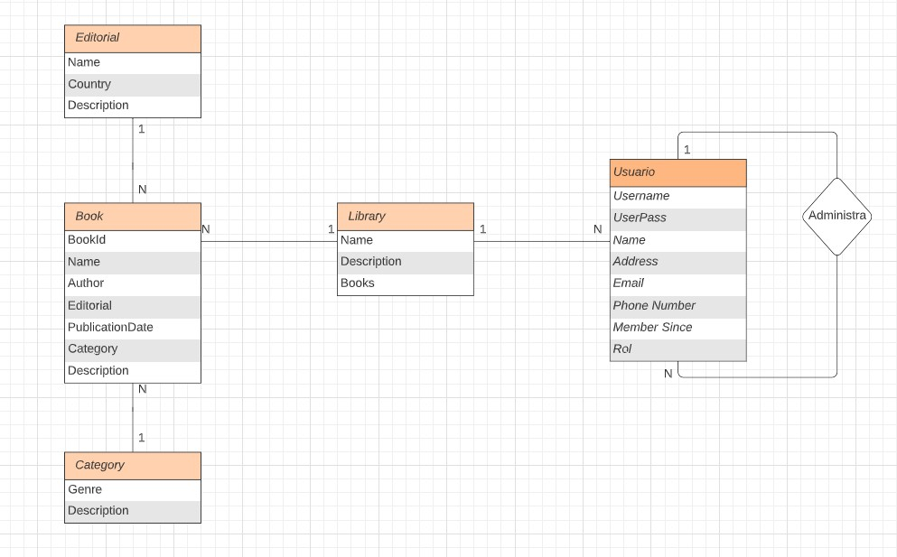

# BackendProject

## Índice

* [Descripción](#descripcion)
* [Entidades](#entidades)
    - [Relacion Entidades](#relacion_entidades)
*[EndPoints](#endpoints)
    - [Usuarios](#usuarios)
    - [Books](#books)
    - [Categorias](#categorias)
    - [Editorial](#editorial)
    - [Libreria](#libreria)
* [Tecnologías](#Tecnologias)
* [Documento inicial](#evidencia_documento_inicial)

## Descripcion

Libravere es una API-REST, esta pensada para proporcionar información a quien la requiera de sus datos que contiene.
Proporciona la información de las entidades creadas, ademas proporciona los métodos CRUD para manejar cada entidad.

## Entidades   

el backend de la API cuenta con las siguientes entidades
* Usuarios
* Libros
* Categoria
* Editorial
* Libreria

Cada uno de las entidades tiene propiamente su CRUD pero con distintos permisos de acceso estos se describen más en el apartado de
[EndPoints](#endpoints)

## Relacion_entidades
la relación de las entidades se describen en la siguiente imagen

## EndPoints

### Usuarios

| Method | End-Point | Description | level access | notas |
| --- | --- | --- | --- | --- |
| `GET` | `/users/` | Enlista *todos* | sin restricción| Solo si es **admin** muestra toda la información de los usuarios, pero si solo es **usuario registrado** o no esta registrado , solo muestra  **Username**,**firstname**, **email**,**rol**    |
| `GET` | `/users/id/:id` | Obtiene un usuario especificado | usuario registrado | --- |
| `POST` | `/users/signUp` | Registra un nuevo usuario en la Base de Datos | sin restricciones | --- |
| `PATCH` | `/users/id/:id` | Modifica un usuario |usuario registrado | un usuario puedo solo modificar su propio perfil, **admin** puede modificar cualquier usuario |
| `DELETE` | `/users/id/:id` | Elimina un usuario especificado | usuario registrado | **admin** solo puede eliminar un usuario |

### Books

| Method | End-Point | Description | level access | notas |
| --- | --- | --- | --- | --- |
| `GET` | `/book/` | Enlista *todos* | sin restricción| --- |
| `POST` | `/book/` | Crea un nuevo libro | usuario registrado | --- |
| `GET` | `/book/id/:id` | Obtiene un libro especificado | usuario registrado | --- |
| `PATCH` | `book/id/:id` | Modifica un libro existente |usuario registrado | --- |
| `DELETE` | `book/id/:id` | Elimina un libro especificado | usuario registrado | --- |

### Categorias

| Method | End-Point | Description | level access | notas |
| --- | --- | --- | --- | --- |
| `GET` | `/Categoria/` | Enlista *todos* | sin restricción| --- |
| `POST` | `/Categoria/` | Crea una categoria | usuario registrado | --- |
| `GET` | `/Categoria/id/:name` | Obtiene una categoría especificada | usuario registrado | *escribir nombre de la editorial como pk* |
| `PATCH` | `/Categoria/id/:name` | Modifica una categoria existente |usuario registrado | *escribir nombre de la editorial como pk* |
| `DELETE` | `/Categoria/id/:name` | Elimina una categoria especificada | usuario registrado | *escribir nombre de la editorial como pk* |

### Editorial

| Method | End-Point | Description | level access | notas |
| --- | --- | --- | --- | --- |
| `GET` | `/editorial/` | Enlista *todos* | sin restricción| --- |
| `GET` | `/editorial/id/:name` | Obtiene una  editorial especificada | usuario registrado | *escribir nombre de la editorial como pk* |
| `POST` | `/editorial/` | Crea una editorial | usuario registrado | --- |
| `PATCH` | `/editorial/id/:name` | Modifica una editorial existente | usuario registrado| *escribir nombre de la editorial como pk* |
| `DELETE` | `/editorial/id/:name` | Elimina una categoria especificada | solo **admin** | *escribir nombre de la editorial como pk* |

### Libreria

| Method | End-Point | Description | level access | notas |
| --- | --- | --- | --- | --- |
| `GET` | `/library/` | Enlista *todos* | sin restricción| --- |
| `GET` | `/library/id/:name` | Obtiene una  editorial especificada | usuario registrado | --- |
| `POST` | `/library/` | Crea una editorial | usuario registrado | --- |
| `PATCH` | `/library/id/:id` | Modifica una editorial existente | usuario registrado| --- |
| `DELETE` | `/library/id/:id` | Elimina una categoria especificada | usuario registrado | --- |

##Tecnologias

* PostegreSQL
* JavaScript
* Node.js
* npm
* Sequelize
* Express.js
* Heroku

## Evidencia_Documento_inicial
En este [Documento inicial](https://docs.google.com/document/d/1Zm7--3V2wiXMalCs8f_o3MtDpoGeK2owIOqlfRb7rno/edit)
en donde fuimos realizando los primeros pasos para la creación y organización del proyecto.
