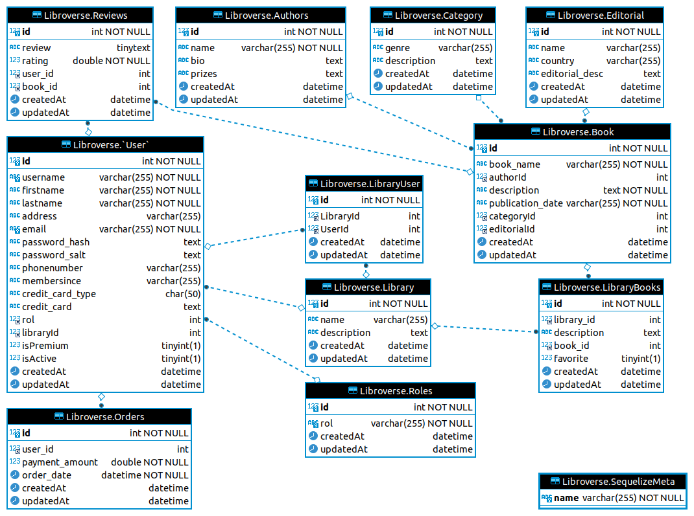
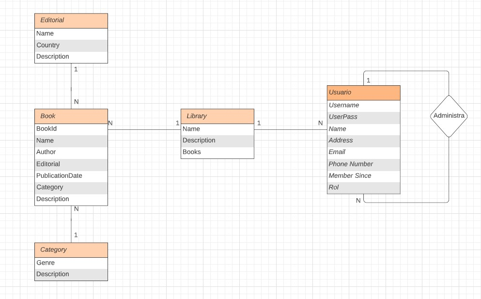

# BackendProject

## Índice

* [Descripción](#descripcion)
* [Instalación](#instalacion)
* [Entidades](#entidades)
    - [Relacion Entidades](#relacion_entidades)
* [Niveles de acceso](#nivel_acceso)
* [EndPoints](#endpoints)
    - [Usuarios](#usuarios)
    - [Books](#books)
    - [Categorias](#categorias)
    - [Editorial](#editorial)
- [Libreria](#libreria)
* [Tecnologías](#Tecnologias)
* [Documento inicial](#evidencia_documento_inicial)

## Descripcion

Libraryverse es una API-REST, esta pensada para proporcionar información a quien la requiera de sus datos que contiene.
Proporciona la información de las entidades creadas, ademas proporciona los métodos CRUD para manejar cada entidad.

## Instalacion

Para probar nuestro proyecto sigue los siguientes pasos

* clonar repositorio a tu repositorio local
* ´npm install` (instala las librerias necesarias)
* `npm run dev` (para iniciar la aplicacion en modo desarrollador

con estos sencillos pasos tienes la aplicación en tu computadora y ahora puedes realizar las peticiones desde Insominia o Postman
usando la siguiente dirección  `localhost:3000/`

## Entidades

el backend de la API cuenta con las siguientes entidades

* Authors
* Books
* Category
* Editorial
* Library
* Orders
* reviews
* rol
* users

Cada uno de las entidades tiene propiamente su CRUD pero con distintos permisos de acceso estos se describen más en el apartado de
[EndPoints](#endpoints)

## Relacion_entidades

la relación de las entidades se describen en la siguiente imagen
### Modelo en Fase 03

### Modelo en Fase 02 --- Anterior

## Nivel_Acceso

Para ingresar a la API hay distintos niveles de acceso los cuales otorgan ciertos privilegios dentro de Libraryverse, los cuales son los siguientes:

* Rol Adminsitrador // Dentro de la API solo hay un usuario como administador
* Rol Editor
* Rol User
* Rol EditorialCompany
* Rol premiumUser

Los roles y sus privilegios se describen en la sección [EndPoints](#endpoints)

## EndPoints

### Usuarios

| Method | End-Point | Description | level access | notas |
| --- | --- | --- | --- | --- |
| `GET` | `/users/` | Enlista *todos* | Solo administrador| --- |
| `GET` | `/users/id/:id` | Obtiene un usuario especificado | Solo Administrador | --- |
| `POST` | `/users/signUp` | Registra un nuevo usuario en la Base de Datos | sin restricciones | --- |
| `PATCH` | `/users/id/:id` | Modifica un usuario |usuario registrado y administrador | --- |
| `DELETE` | `/users/id/:id` | Elimina un usuario especificado | Solo Administrador | **admin** solo puede eliminar un usuario |
| `GET` | `/users/search/atributos` | Obtienes los usuarios filtrado por los atributos indicados | Solo Administrador | --- |
| `GET` | `/users/search/rol/:rol` | Obtiene los usuarios filtrado por el rol indicado | Solo Administrador | --- |
| `POST` | `/users/logIn` | Esta ruta se utiliza para iniciar sesión en la API y obtener acceso | Sin restricción | ingresa un username y un password previamente registrados en la DB |

### Books

| Method | End-Point | Description | level access | notas |
| --- | --- | --- | --- | --- |
| `GET` | `/book/` | Enlista *todos* | sin restricción| --- |
| `POST` | `/book/` | Crea un nuevo libro | usuario registrado como Editor | --- |
| `GET` | `/book/id/:id` | Obtiene un libro especificado indicado por el ID| sin restricción | --- |
| `PUT` | `book/id/:id` | Modifica un libro existente |usuario registrado como Editor| --- |
| `DELETE` | `book/id/:id` | Elimina un libro especificado | Solo Administrador | --- |

### Categorias

| Method | End-Point | Description | level access | notas |
| --- | --- | --- | --- | --- |
| `GET` | `/Categoria/` | Enlista *todos* | sin restricción| --- |
| `POST` | `/Categoria/` | Crea una categoria | usuario registrado como Editor| --- |
| `GET` | `/Categoria/id/:genre` | Obtiene una categoría especificada | sin restricción | --- |
| `PUT` | `/Categoria/id/:genre` | Modifica una categoria existente |usuario registrado como Editor | --- |
| `DELETE` | `/Categoria/id/:name` | Elimina una categoria especificada | Solo administrador | --- |

### Editorial

| Method | End-Point | Description | level access | notas |
| --- | --- | --- | --- | --- |
| `GET` | `/editorial/` | Enlista *todos* | sin restricción| --- |
| `GET` | `/editorial/id/:name` | Obtiene una  editorial especificada | usuario registrado | *escribir nombre de la editorial como pk* |
| `POST` | `/editorial/` | Crea una editorial | usuario registrado | --- |
| `PATCH` | `/editorial/id/:name` | Modifica una editorial existente | usuario registrado| *escribir nombre de la editorial como pk* |
| `DELETE` | `/editorial/id/:name` | Elimina una categoria especificada | solo **admin** | *escribir nombre de la editorial como pk* |

### Libreria

| Method | End-Point | Description | level access | notas |
| --- | --- | --- | --- | --- |
| `GET` | `/library/` | Enlista *todos* | sin restricción| --- |
| `GET` | `/library/id/:name` | Obtiene una  editorial especificada | sin restricción | --- |
| `POST` | `/library/` | Crea una editorial | usuario registrado como Editor | --- |
| `PUT` | `/library/id/:id` | Modifica una editorial existente | usuario registrado como Editor| --- |
| `DELETE` | `/library/id/:id` | Elimina una categoria especificada | Solo administrador | --- |

## Tecnologias

* PostegreSQL
* JavaScript
* Node.js
* npm
* Sequelize
* Express.js
* Heroku

## Evidencia_Documento_inicia

En este [Documento inicial](https://docs.google.com/document/d/1Zm7--3V2wiXMalCs8f_o3MtDpoGeK2owIOqlfRb7rno/edit)
en donde fuimos realizando los primeros pasos para la creación y organización del proyecto. MergingNpx sequelize db:seed:allá --env
